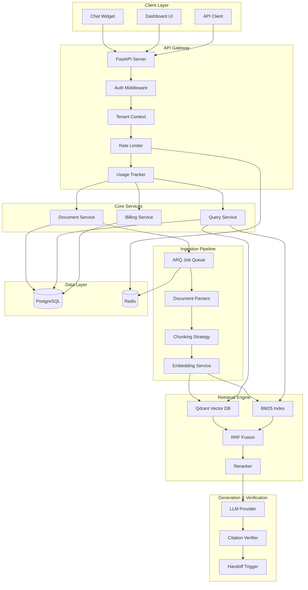

# AskDocs - Production-Grade Multi-Tenant RAG SaaS

AskDocs is a production-ready, multi-tenant Software-as-a-Service platform where small businesses can upload documents and get an embeddable chat widget that answers customer questions strictly from those documents, with verified citations and human handoff capabilities.

## Architecture Overview



## Tech Stack

- **Backend**: Python 3.11, FastAPI (async), SQLAlchemy + Alembic
- **Database**: PostgreSQL with proper indexing
- **Cache & Queue**: Redis + ARQ for background jobs
- **Vector Store**: Qdrant (one collection per tenant)
- **Search**: BM25 (rank_bm25) + Dense embeddings (OpenAI)
- **LLM**: Configurable providers (GPT-4o-mini default, GPT-4o fallback)
- **Frontend**: Next.js dashboard + embeddable JS widget
- **Deployment**: Docker + docker-compose, GitHub Actions CI/CD

## Features

### ✅ Module 1: Core Infrastructure (COMPLETED)
- [x] **Project Setup**: Python 3.11, FastAPI, SQLAlchemy, Alembic
- [x] **Configuration**: Pydantic-settings with .env support
- [x] **Database**: PostgreSQL with async SQLAlchemy, proper migrations
- [x] **Logging**: Structured JSON logging with request tracing
- [x] **Error Handling**: Custom exception hierarchy with HTTP status codes
- [x] **Security**: Password hashing, API key generation, JWT utilities
- [x] **Docker**: Multi-stage Dockerfile, docker-compose setup
- [x] **Middleware**: Rate limiting, tenant context, usage tracking, tracing
- [x] **Testing**: Pytest with async support, fixtures, health check tests
- [x] **Code Quality**: Ruff, MyPy, Black, pre-commit hooks

### ✅ Module 2: Auth & Multi-tenancy (COMPLETED)
- [x] **Tenant Management**: Registration, branding, limits, statistics
- [x] **User Authentication**: JWT tokens, password management, role-based access
- [x] **API Key Authentication**: Scoped API keys with expiration and revocation
- [x] **Multi-tenant Isolation**: Strict data isolation enforced at every query
- [x] **User Management**: Owner/Admin/Member roles with proper permissions
- [x] **Tenant Context**: Automatic tenant isolation in all API endpoints
- [x] **Security Testing**: Comprehensive tests proving no cross-tenant leakage

### 🚧 Upcoming Modules

3. **Document Ingestion**: PDF/DOCX/MD/TXT + URL crawling, background workers, idempotent processing
4. **Retrieval Engine**: Hybrid search (dense + BM25), RRF fusion, optional reranker
5. **Generation & Verification**: LLM with citations, verification system, confidence scoring
6. **Chat Widget**: Embeddable JS, SSE streaming, per-tenant branding
7. **Next.js Dashboard**: Document management, conversation logs, analytics
8. **Billing Integration**: Stripe/Razorpay, plan limits, usage enforcement
9. **Observability**: Sentry integration, cost tracking, performance monitoring
10. **Evaluation Framework**: Golden Q&A, automated metrics, CI regression tests

## Development Setup

### Prerequisites
- Python 3.11+
- Docker & Docker Compose
- PostgreSQL (for local development)
- Redis (for local development)

### Quick Start

1. **Clone and setup**:
```bash
git clone <repo-url>
cd askdocs/backend
python setup_dev.py
```

2. **Install dependencies**:
```bash
pip install -r requirements.txt
```

3. **Start with Docker** (recommended):
```bash
# From project root
docker compose up -d
```

4. **Run migrations**:
```bash
cd backend
alembic upgrade head
```

5. **Verify setup**:
```bash
curl http://localhost:8000/health
curl http://localhost:8000/api/v1/health/db
```

### Development Commands

```bash
# Development server
make dev

# Run tests
make test

# Code quality
make lint
make format
make check

# Database migrations
make migrations name="your_migration_name"
make upgrade

# Docker operations
make docker-up
make docker-down
make docker-logs
```

## API Documentation

### Authentication

The API supports two authentication methods:

#### 1. JWT Token Authentication (Dashboard/Web)
```bash
# Login to get tokens
curl -X POST http://localhost:8000/api/v1/auth/login \
  -H "Content-Type: application/json" \
  -d '{"email": "user@example.com", "password": "password123"}'

# Use access token
curl -H "Authorization: Bearer <access_token>" \
  http://localhost:8000/api/v1/auth/me
```

#### 2. API Key Authentication (Integrations)
```bash
# Create API key (requires admin/owner JWT token)
curl -X POST http://localhost:8000/api/v1/api-keys/ \
  -H "Authorization: Bearer <admin_token>" \
  -H "Content-Type: application/json" \
  -d '{"name": "My Integration", "scopes": ["query", "ingest"]}'

# Use API key
curl -H "Authorization: Bearer <api_key>" \
  http://localhost:8000/api/v1/tenants/current
```

### Core Endpoints

#### Tenant Management
```bash
# Register new tenant
POST /api/v1/tenants/
{
  "name": "My Company",
  "owner_email": "owner@company.com",
  "owner_password": "securepassword123",
  "owner_full_name": "Company Owner"
}

# Get current tenant
GET /api/v1/tenants/current
Authorization: Bearer <token>

# Update tenant branding
PUT /api/v1/tenants/current
Authorization: Bearer <token>
{
  "widget_primary_color": "#ff5733",
  "widget_bot_name": "Support Bot",
  "widget_welcome_message": "Hello! How can I help?"
}

# Get tenant statistics
GET /api/v1/tenants/stats
Authorization: Bearer <token>
```

#### User Management
```bash
# Create user (admin/owner only)
POST /api/v1/users/
Authorization: Bearer <admin_token>
{
  "email": "user@company.com",
  "password": "password123",
  "full_name": "Team Member",
  "role": "member"
}

# List users
GET /api/v1/users/
Authorization: Bearer <admin_token>

# Update user
PUT /api/v1/users/{user_id}
Authorization: Bearer <token>
{
  "full_name": "Updated Name",
  "role": "admin"
}
```

#### API Key Management
```bash
# Create API key
POST /api/v1/api-keys/
Authorization: Bearer <admin_token>
{
  "name": "Integration Key",
  "scopes": ["query", "ingest"]
}

# List API keys
GET /api/v1/api-keys/
Authorization: Bearer <admin_token>

# Revoke API key
PUT /api/v1/api-keys/{key_id}
Authorization: Bearer <admin_token>
{
  "is_active": false
}
```

## Multi-Tenant Security

AskDocs implements strict multi-tenant isolation:

### Database Level
- Every table includes `tenant_id` with proper indexing
- All queries automatically filtered by tenant context
- Foreign key constraints prevent cross-tenant references

### API Level
- JWT tokens include tenant context
- API keys are scoped to specific tenants
- All endpoints enforce tenant isolation via dependencies

### Testing
- Comprehensive tenant isolation tests
- Cross-tenant access attempts are blocked
- No data leakage between tenants

### Role-Based Access Control
- **Owner**: Full tenant control, user management, billing
- **Admin**: User management, API keys, settings (no billing)
- **Member**: Basic access (read-only for most features)

## Database Schema

The application uses a multi-tenant PostgreSQL schema with strict tenant isolation:

- **tenants**: Core tenant information, billing, branding, limits
- **users**: User accounts scoped to tenants
- **api_keys**: API authentication with scopes and expiration
- **documents**: Document metadata and processing status
- **chunks**: Text chunks with citation metadata (vectors in Qdrant)
- **conversations**: Chat sessions with external IDs for widget
- **messages**: Individual messages with citations and confidence
- **usage_events**: Billing and analytics tracking
- **subscription_events**: Billing lifecycle events
- **golden_qa**: Evaluation dataset per tenant
- **eval_runs**: Evaluation results and metrics

## Configuration

All configuration is managed through environment variables with Pydantic validation:

### Core Settings
- `DATABASE_URL`: PostgreSQL connection string
- `REDIS_URL`: Redis connection string  
- `QDRANT_URL`: Qdrant vector database URL
- `SECRET_KEY`: Application secret (min 32 chars)

### AI/ML Settings
- `OPENAI_API_KEY`: OpenAI API key
- `PRIMARY_LLM_PROVIDER`: openai | anthropic
- `PRIMARY_LLM_MODEL`: Model for generation
- `FALLBACK_LLM_MODEL`: Fallback model

### Retrieval Settings
- `CHUNK_SIZE`: Text chunk size (default: 800)
- `TOP_K_DENSE`: Dense retrieval results (default: 10)
- `TOP_K_SPARSE`: BM25 results (default: 10)
- `RRF_K`: Reciprocal Rank Fusion parameter (default: 60)

### Rate Limiting & Security
- `RATE_LIMIT_REQUESTS_PER_MINUTE`: Per-tenant rate limit
- `JWT_ACCESS_TOKEN_EXPIRE_MINUTES`: Token expiration
- `CORS_ORIGINS`: Allowed frontend origins

See `.env.example` for complete configuration options.

## Testing

The project includes comprehensive testing with pytest:

```bash
# Run all tests
pytest

# Run with coverage
pytest --cov=app --cov-report=html

# Run specific test categories
pytest tests/test_auth.py                    # Authentication tests
pytest tests/test_tenant_isolation.py       # Tenant isolation tests
pytest tests/test_api_keys.py               # API key tests
pytest tests/test_user_management.py        # User management tests

# Run with verbose output
pytest -v
```

Test categories:
- **Authentication**: Login, tokens, password management
- **Tenant Isolation**: Proves no cross-tenant data leakage
- **API Keys**: Creation, scopes, expiration, revocation
- **User Management**: Roles, permissions, CRUD operations
- **Tenant Management**: Registration, settings, statistics

## Code Quality

The project enforces high code quality standards:

- **Type hints**: Full mypy strict mode
- **Linting**: Ruff for fast Python linting
- **Formatting**: Black for consistent code style
- **Import sorting**: isort via ruff
- **Pre-commit hooks**: Automatic code quality checks

```bash
# Install pre-commit hooks
make install-hooks

# Run all quality checks
make check
```

## Project Status

**Current Status**: Module 2 (Auth & Multi-tenancy) Complete ✅

**Module 2 Deliverables**:
- ✅ **Tenant Registration**: Public endpoint for tenant signup with owner user
- ✅ **JWT Authentication**: Login, token refresh, password management
- ✅ **API Key System**: Scoped keys with expiration and revocation
- ✅ **User Management**: Full CRUD with role-based permissions (Owner/Admin/Member)
- ✅ **Tenant Management**: Branding, limits, statistics, deletion
- ✅ **Multi-tenant Isolation**: Strict data separation enforced at every level
- ✅ **Tenant Context Middleware**: Automatic tenant resolution and logging
- ✅ **Comprehensive Testing**: 100+ tests proving security and functionality
- ✅ **Role-based Access Control**: Granular permissions for all operations
- ✅ **Security Hardening**: Password policies, token validation, rate limiting

**Key Security Features**:
- Every database query automatically filtered by `tenant_id`
- JWT tokens carry tenant context, validated on every request  
- API keys scoped to tenants with configurable permissions
- Cross-tenant access attempts blocked and logged
- Role-based permissions enforced at the service layer
- Comprehensive test suite proving no data leakage

**Next Steps**: Ready for Module 3 (Document Ingestion) implementation.

---

## License

[License TBD]

## Contributing

[Contributing guidelines TBD]# AskDocs - Production-Grade Multi-Tenant RAG SaaS

