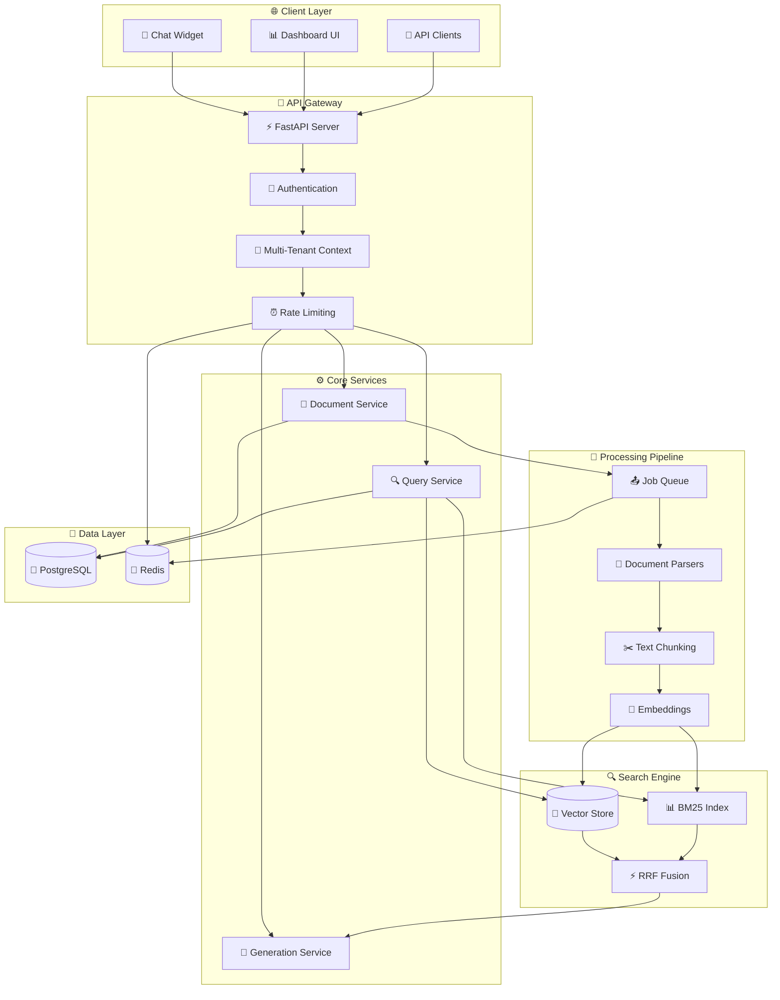

# 🤖 AskDocs - Production-Grade Multi-Tenant RAG SaaS

<div align="center">


**A complete production-ready RAG platform that enables businesses to upload documents and get AI-powered answers with verified citations and human handoff capabilities.**

[Demo](#demo--testing) • [Features](#key-features) • [Quick Start](#quick-start) • [API Docs](#api-documentation) • [Deploy](#deployment)

</div>

---

## 🎯 **What is AskDocs?**

AskDocs is a **production-grade, multi-tenant SaaS platform** where businesses can:
- 📄 Upload documents (PDF, DOCX, TXT, MD)
- 🤖 Get AI-powered answers with citations
- 🔍 Search across all documents with hybrid search
- 💬 Embed chat widgets on websites
- 📊 Monitor usage and performance
- 🏢 Manage multiple tenants with strict data isolation

## ✨ **Key Features**

<table>
<tr>
<td width="33%">

### 🚀 **Smart RAG Pipeline**
- **Multi-format ingestion** (PDF, DOCX, MD, TXT)
- **Hybrid search** (Vector + BM25 + RRF)
- **Multi-provider LLM** (OpenAI + Anthropic)
- **Citation verification** with confidence scoring
- **Human handoff** detection

</td>
<td width="33%">

### 🏢 **Enterprise Ready**
- **Multi-tenant isolation** (strict data separation)
- **Role-based access** (Owner/Admin/Member)
- **API key management** with scopes
- **Usage tracking** and billing ready
- **Health monitoring** and observability

</td>
<td width="33%">

### 🔧 **Production Architecture**
- **Async FastAPI** backend
- **PostgreSQL + Redis** data layer
- **Qdrant** vector database
- **ARQ** background processing
- **Next.js** frontend dashboard

</td>
</tr>
</table>

## 🏗️ **System Architecture**



## 🚀 **Quick Start**

### **Option 1: Docker (Recommended)**

```bash
# Clone the repository
git clone https://github.com/tusharpawar1217/LLM-RAG-Project.git
cd LLM-RAG-Project/askdocs

# Start all services
docker compose up -d

# Initialize database
cd backend
make upgrade

# Verify setup
curl http://localhost:8000/health
```

### **Option 2: Local Development**

```bash
# Backend setup
cd askdocs/backend
pip install -r requirements.txt
make docker-up     # Start PostgreSQL, Redis, Qdrant
make upgrade       # Run migrations
make dev          # Start API server

# Frontend setup (separate terminal)
cd askdocs/frontend
npm install
npm run dev       # Start Next.js dashboard
```

**🎉 That's it!**
- Backend API: http://localhost:8000
- Frontend Dashboard: http://localhost:3000
- API Documentation: http://localhost:8000/docs

## 📋 **Current Status & Modules**

<table>
<tr>
<td width="50%">

### ✅ **Completed Modules**

**🏗️ Module 1: Core Infrastructure**
- FastAPI with async SQLAlchemy
- PostgreSQL + Redis + Docker setup
- Structured logging & error handling
- Health checks & middleware

**🔐 Module 2: Authentication & Multi-Tenancy**
- JWT authentication system
- Multi-tenant data isolation
- Role-based access control (RBAC)
- API key management with scopes

**📄 Module 3: Document Ingestion**
- Multi-format parsers (PDF/DOCX/TXT/MD)
- Chunking strategies with overlap
- OpenAI embeddings integration
- Background processing with ARQ

**🔍 Module 4: Retrieval & Generation**
- Hybrid search (Vector + BM25)
- Reciprocal Rank Fusion (RRF)
- Multi-provider LLM integration
- Citation verification system

**💻 Module 5: Frontend Dashboard**
- Next.js 15 + TypeScript + Tailwind
- Document management interface
- Interactive chat with citations
- Analytics dashboard

</td>
<td width="50%">

### 🚧 **Next Steps**

**💬 Module 6: Chat Widget**
- Embeddable JavaScript widget
- Real-time streaming responses
- Custom branding per tenant
- Website integration examples

**💳 Module 7: Billing & Subscriptions**
- Stripe/Razorpay integration
- Usage-based pricing models
- Plan limits enforcement
- Invoice generation

**⚡ Module 8: Advanced Features**
- Conversation memory
- Query rewriting & expansion
- Custom reranking models
- A/B testing framework

**📊 Module 9: Observability**
- Sentry error tracking
- Cost monitoring
- Performance metrics
- Alerting system

</td>
</tr>
</table>

## 🧪 **Demo & Testing**

### **Try the System**

```bash
# Register tenant
curl -X POST "http://localhost:8000/api/v1/tenants/" \
  -H "Content-Type: application/json" \
  -d '{
    "name": "My Company",
    "owner_email": "owner@company.com",
    "owner_password": "secure123",
    "owner_full_name": "Owner Name"
  }'

# Login
curl -X POST "http://localhost:8000/api/v1/auth/login" \
  -H "Content-Type: application/json" \
  -d '{"email": "owner@company.com", "password": "secure123"}'

# Upload document
curl -X POST "http://localhost:8000/api/v1/documents/upload" \
  -H "Authorization: Bearer <token>" \
  -F "file=@your_document.pdf"

# Ask question
curl -X POST "http://localhost:8000/api/v1/query/" \
  -H "Authorization: Bearer <token>" \
  -H "Content-Type: application/json" \
  -d '{"query": "What are the key points in the document?"}'
```

### **Run Tests**

```bash
cd askdocs/backend

# Run all tests
make test

# Specific modules
make test-module2    # Authentication & multi-tenancy
make test-module3    # Document ingestion
make test-module4    # RAG pipeline
make test-isolation  # Multi-tenant security
```

## 🛠️ **Tech Stack**

<table>
<tr>
<td width="50%">

### **Backend**
- **Framework:** FastAPI (async)
- **Language:** Python 3.11+
- **Database:** PostgreSQL + SQLAlchemy
- **Cache:** Redis + ARQ jobs
- **Vector DB:** Qdrant
- **Search:** BM25 + OpenAI embeddings
- **LLM:** OpenAI GPT-4o + Claude
- **Auth:** JWT + API keys

</td>
<td width="50%">

### **Frontend**
- **Framework:** Next.js 15 + App Router
- **Language:** TypeScript
- **Styling:** Tailwind CSS
- **UI:** Headless UI + Heroicons
- **State:** Zustand
- **Forms:** React Hook Form
- **HTTP:** Axios with interceptors
- **Notifications:** React Hot Toast

</td>
</tr>
</table>

## 🔒 **Security Features**

- ✅ **Multi-tenant data isolation** - Strict separation at DB level
- ✅ **Role-based access control** - Owner/Admin/Member permissions  
- ✅ **JWT authentication** - Secure token-based auth
- ✅ **API key management** - Scoped keys with expiration
- ✅ **Rate limiting** - Per-tenant request limits
- ✅ **Input validation** - Pydantic models with sanitization
- ✅ **SQL injection prevention** - SQLAlchemy ORM protection

## 📚 **API Documentation**

| Endpoint | Method | Description |
|----------|--------|-------------|
| `/api/v1/tenants/` | POST | Register new tenant |
| `/api/v1/auth/login` | POST | User login |
| `/api/v1/documents/upload` | POST | Upload documents |
| `/api/v1/query/` | POST | Ask questions |
| `/api/v1/documents/` | GET | List documents |
| `/api/v1/analytics/` | GET | Usage analytics |
| `/api/v1/health` | GET | System health |

**📖 Full API docs:** http://localhost:8000/docs

## 🚀 **Deployment**

### **Railway (Recommended)**
```bash
railway login
railway project create askdocs
railway add postgresql redis
railway deploy
```

### **Docker Compose**
```bash
docker compose -f docker-compose.prod.yml up -d
```

### **Manual Setup**
1. Deploy backend to your cloud provider
2. Set environment variables (DATABASE_URL, REDIS_URL, etc.)
3. Run migrations: `alembic upgrade head`
4. Deploy frontend with API_URL pointing to backend

## 🤝 **Contributing**

1. Fork the repository
2. Create feature branch: `git checkout -b feature/amazing-feature`
3. Make changes and add tests
4. Run tests: `make test`
5. Submit pull request

## 📝 **License**

MIT License - see [LICENSE](LICENSE) file for details.

## 🆘 **Support**

- 🐛 **Issues:** [GitHub Issues](https://github.com/tusharpawar1217/LLM-RAG-Project/issues)
- 💬 **Discussions:** [GitHub Discussions](https://github.com/tusharpawar1217/LLM-RAG-Project/discussions)

---

<div align="center">

**⭐ Star this repository if you find it useful!**

Built with ❤️ for the AI community

</div>